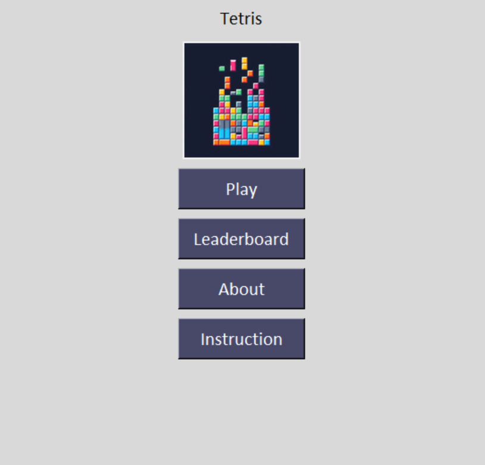
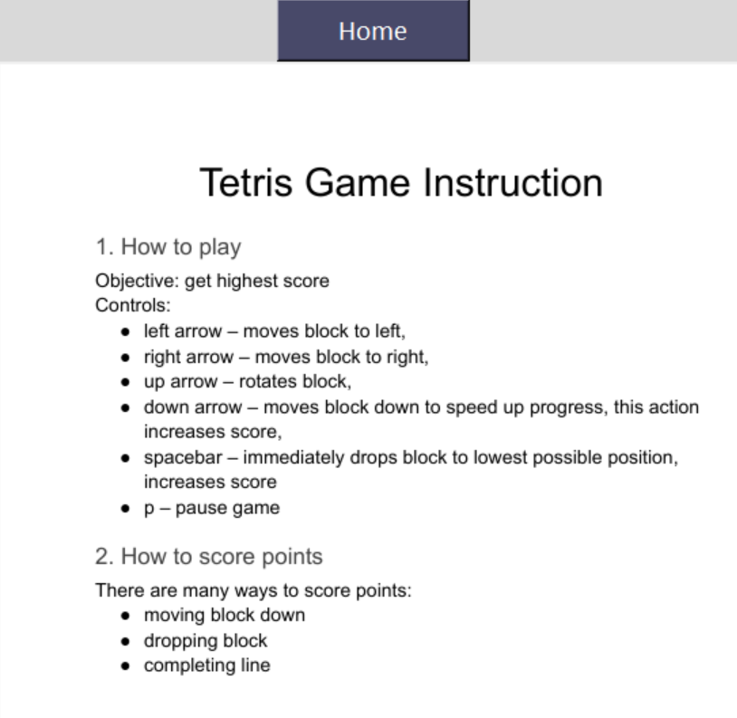
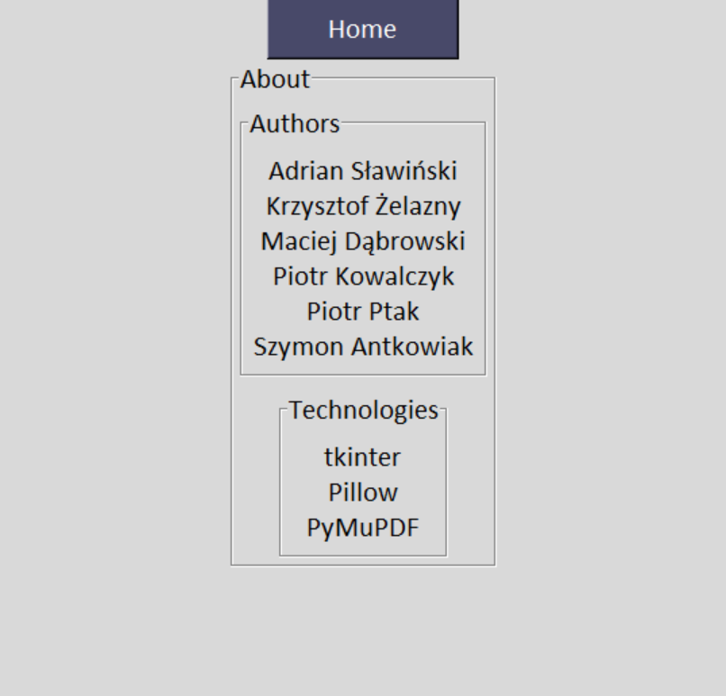
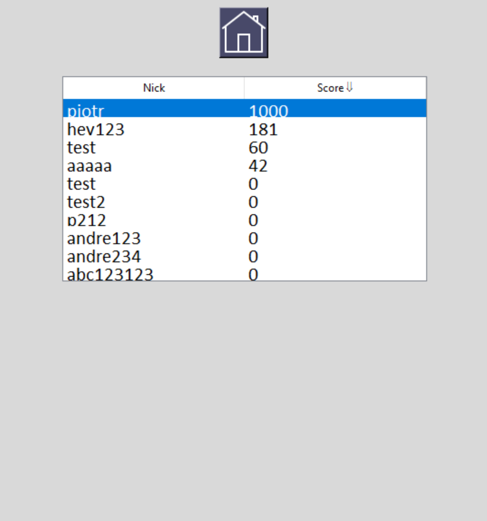
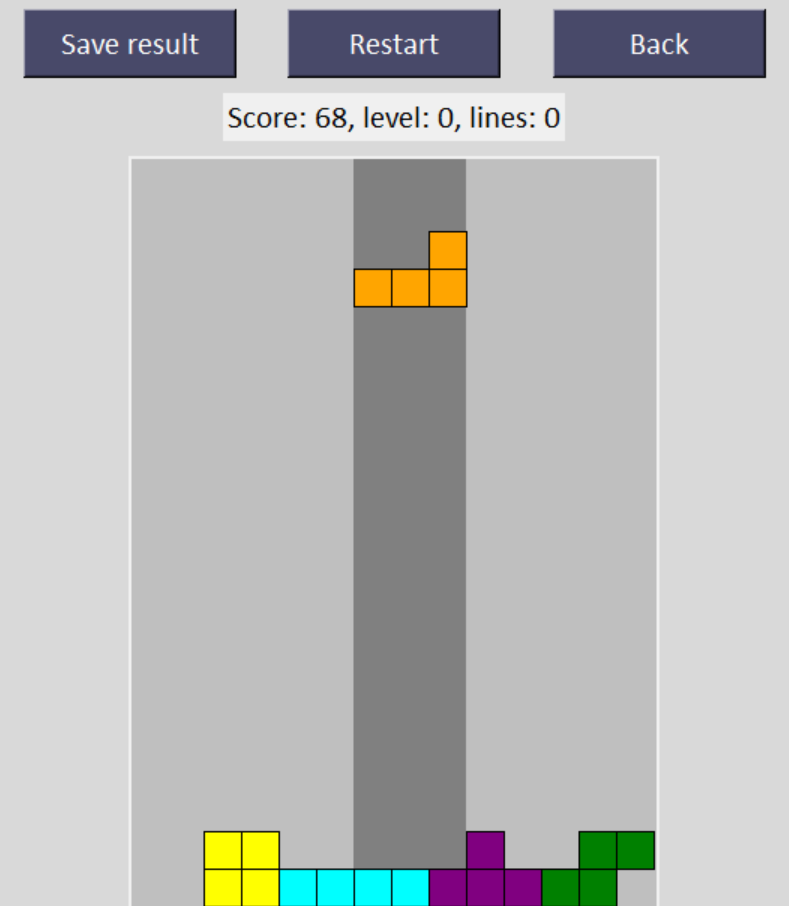

# PZ - Tetris - user manual

## Table of contents
- [How to run the app?](#how-to-run-the-app)
- [Pages overview](#pages-overview)
- [Game modes](#game-modes)

## How to run the app?

The app can be run via standalone executable provided via email or by following instructions from the **README.md** file.

## Pages overview

### Main
When user launches the app, this is the view that will be displayed:

### Instruction
From this page, you can navigate to the `Instruction` page where all the game controls are explained:

Once you click *Home* button, you will be navigated back to the home screen. 

### About
The `About` view displays the game authors:

### Leaderboard
`Leaderboard` page lists all global scores sorted by nick or score:

## Game modes
The game offers 2 game modes:
- Standard
- Random speed

In the first one, game speed increases as the player scores more points whereas in the second one, blocks fall with random velocity.
Once user enters the `Standard` game mode, this is what will be painted on the screen:
 

Allowed moves and controls are explained in `Instruction` page.

Other actions allowed at this view:
* Save result - save the game score
* Restart - play again
* Back - go back to the main menu